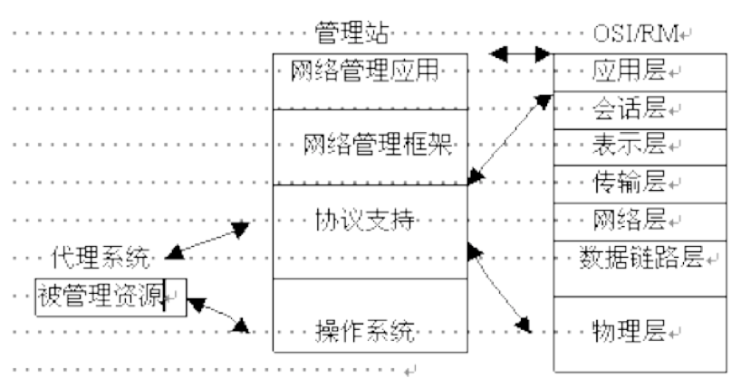

# 网络管理

## 课程目标

- [x] 1.掌握网络管理的概念、标准、功能和协议 
- [ ] 2. 掌握网络配置和管理的方法、实用技术 
- [ ] 3. 掌握网络管理工具的使用

## 基础知识

* 😊【考题】简述网络管理的概念及主要功能（5大功能）。

    - 【参考1】网络管理是指规划、监督、设计和控制网络资源的使用和网络的各种活动，以使网络的性能达到最优。
    - 【参考2】
            指对网络运行状态的监测和控制，以使其能够有效、可靠、安全、经济的提供服务。
            监测是控制的前提，控制是监测的结果

* 😊 网络管理五大功能：（ISO定义）【考题】
   
   * 功能：
        - 故障管理 —— 是网络管理的**核心**功能。主要目的是尽早发现故障，找出故障发生的原因，以便及时排除故障，保障网络的正常运行。
        - 计费管理 ⚠️ —— 控制和监测网络操作的费用和代价
        - 配置管理 ⚠️ —— 提供所有被管对象的配置信息，是所有其他网络功能的**基础**。
        - 性能管理 —— 维护网络服务质量和网络运营效率
        - 安全管理 —— 保证网络资源不被非法使用，防止网络资源由于入侵者攻击而遭受破坏;对安全信息的维护和资源的访问控制
    
    * 配置管理
        
        - 基本功能【未看】
            + 设置被管对象或系统的参数;
            + 初始化、启动和关闭网络及其相应设备;   
            + 收集被管对象或系统的状态数据;
            + 改变被管对象或系统地配置;
            + 定义和修改管理对象间的关系;
            + 通过网络发布新软件生成配置状态报告。

    * 故障管理
        
        - 基本功能【未看】
            + 故障检测和报警
            + 故障预测
            + 故障诊断和定位 
            + 故障信息管理

    * 性能管理
        
        - 【未看】
            主要是监视和分析被管网络及其所提供的服务， 收集分析有关被管网络当前状况的数据信息，存储和分析 性能日志，以评估系统资源的运行状况等系统性能，检验 网络服务是否达到了预定的水平，找出已经发生或潜在的 网络瓶颈，报告网络性能的变化趋势，为网络管理决策提 供依据。

        - 性能监测: 性能监测指网络工作状态信息的收集和整理【未看】
        - 网络控制：为改善网络设备的性能而采取的 动作和措施 【未看】

        - 基本功能：
            + 性能监控
            + 性能预警
            + 性能分析
            + 性能报告
            + 性能查询
        - 【考题】性能指标有哪些？具体含义？⚠️
            + **【参考】**
            + 流量
            + 延迟
            + 丢包率
            + CPU利用率
            + 内存余量
            + 温度
        

    * 安全管理

        - 安全管理技术 ⚠️
            + 数据加密技术
            + 防火墙技术
            + 网络安全扫描技术 
            + 网络入侵监测技术
            + 黑客诱骗技术
    * 计费管理
        

* 😊 网络管理的标准

    - 公共管理信息服务协议 CMIS
    - 公共管理信息协议 CMIP 
    - 简单网络管理协议 SNMP
    - 电信管理网 TMN

* 网络管理系统基本模型
    + 四要素
        - 管理者
        - 管理代理
        - 管理信息库
            + 定义：概念上的数据库，定义了一个网络中所有可能被管理的对象的集合的数据结构，指明了网络元素所维持的变量
        - 管理协议
    
    + 模式
        - 集中式网络管理模式
        - 分布式网络管理模式
        - 混合式网络管理模式

    + 每个节点都包含一组与管理有关的软件，称为：网络管理实体【代理模块】
    + 【考题】层次结构图

        
        - 被管理资源 <- - ->  管理站 <- - ->  OSI 七层
        - 管理站 ⚠️
            + 网络管理应用
            + 网路管理框架
            + 协议支持
            + 操作系统
    
    + 基于SNMP的网络管理系统
        - 网络管理器：管理被管理对象的软件
        - 被管理的代理是指**一种起接口作用的实体**  ⚠️
        - 它们通过**简单网络管理协议**进行通信
        - 构成了基于 ____ 模式的应用系统

* 网络管理的对象

     - 硬件资源

        - 物理介质
        - 计算机设备
        - 网络互联设备

     - 软件资源

        - 操作系统
        - 应用软件
        - 通信软件

## 网络监视

* 定义
    - 捕获局域网上的每个包，并对其进行统计、分析
    - 捕获的每个包仍然按照原有的方式传递，其内容不发生变化

* 功能
    - 用于**局域网整体流量参数的统计、分析**
        + 性能统计：每秒传递的包数及包的大小分布
        + 错误统计：小于或大于规定大小的包数或冲突🌲

* 网络监控
    - 有用的管理信息：静态信息，动态信息和**统计信息 **
    - 【考题】对网络监控有用的管理信息可以分为3类：静态信息、动态信息和_________。

## 考题

- 系统管理包含所有7层管理对象，管理信息的交换采用________的可靠传输。 D
 
    A.端到层 B.层到端 C.层到层 D.端到端

- 网络中各节点的网络管理实体（NME）模块称为**代理**模块。

- 在网络管理系统中，为了对非标准设备进行管理，通常使用哪个设备进行管理? （ ）B
    
    A.Manager	B.Proxy	 C.Probe	D.Monitor

- 【未】网络管理功能可分为网络监视和_________两大部分，统称网络监控

## 作业

* 什么是网络管理?
* 网络管理的标准有哪些?
* 网络管理系统的五大功能是什么?分别对每个功能 进行简单的描述。