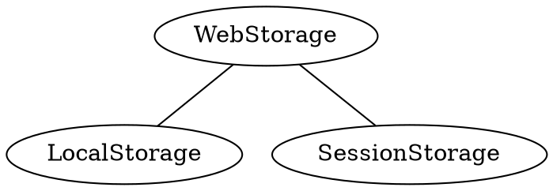

## CacheStorage缓存存储


## Web Storage

### 
### LocalStorage本地存储

**Q1: **localStorage 是干什么的？

**Q2: **localStorage 的最大存储空间是多少？如果存超了会怎么样？
**A2: **目前业界基本上统一为5M，已经比cookies的4K要大很多了

[测试代码](https://github.com/Me-Momo/daily-fragment/blob/master/src/WebStorage/webStorage.ts)

```javascript
const localStorage: {
   run: (key, value, done: Done) => {
      try {
        localStorage.setItem(key, value);
        done(true);
      } catch (e) {
        done(false, e); // 判断异常，可用于判断是否达到最大存储了
      }
    }
}
```

**Q3: **localStorage 是注册在几级域名底下的？
**A3: **和访问的域名一致。

**Q4: **如何测试用户当前浏览器是否支持localstorage
**A4: **目前普遍的做法是检测`window.localStorage`是否存在，但某些浏览器存在bug，虽然“支持”localstorage，但在实际过程中甚至可能出现无法setItem()这样的低级bug。可以通过判断getItem或者setItem是否存在判断
```javascript
 const localStorage: {
    setup: (done: Done) => {
      try {
        if (!localStorage.getItem) {
          return done(false);
        }
      } catch (e) {
        return done(false);
      }
      localStorage.clear();
      return done(true);
    },
}
```


## 插件
https://github.com/marcuswestin/store.js

